# Visual Question Answering with Explanatory Answers
# A Comparative Study of CNN-LSTM Architectures with Attention Mechanisms

---

## Table of Contents

1. [Introduction](#1-introduction)
2. [Related Work](#2-related-work)
3. [Problem Statement](#3-problem-statement)
4. [Dataset & Preprocessing](#4-dataset--preprocessing)
5. [System Architecture Overview](#5-system-architecture-overview)
6. [Model Architectures](#6-model-architectures)
7. [Shared Components](#7-shared-components)
8. [Training Pipeline](#8-training-pipeline)
9. [Key Architectural Improvements](#9-key-architectural-improvements)
10. [Optimization Techniques](#10-optimization-techniques)
11. [Inference & Decoding](#11-inference--decoding)
12. [Evaluation Metrics](#12-evaluation-metrics)
13. [Hyperparameters Summary](#13-hyperparameters-summary)
14. [Parameter Count & Complexity](#14-parameter-count--complexity)
15. [Experimental Results](#15-experimental-results)
16. [Comparison & Analysis](#16-comparison--analysis)
17. [Conclusion](#17-conclusion)
18. [References](#18-references)

---

## 1. Introduction

### 1.1 Motivation

Visual Question Answering (VQA) is one of the most challenging tasks in multimodal artificial intelligence, requiring a system to jointly understand visual content (images) and natural language (questions) to produce meaningful answers. Unlike pure image classification or text generation, VQA demands the integration of two fundamentally different modalities — a problem at the core of building intelligent systems that perceive and reason about the world.

**Why VQA?** VQA serves as a comprehensive benchmark for multimodal understanding because it requires:
- **Visual perception** — recognizing objects, scenes, attributes, and spatial relationships
- **Language comprehension** — parsing questions of varying complexity (what, where, how many, why)
- **Cross-modal reasoning** — connecting visual evidence to linguistic concepts
- **Answer generation** — producing coherent natural language responses

These combined demands make VQA an ideal testbed for studying how well a model integrates vision and language — two capabilities that are trivial for humans but remain deeply challenging for machines.

### 1.2 Research Questions

This project investigates three core questions:

1. **Does transfer learning help?** — How do pretrained ImageNet features (ResNet101) compare against a CNN trained from scratch for visual understanding in VQA?
2. **Does attention help?** — How does an attention mechanism (allowing the decoder to selectively focus on specific image regions and question words) compare against a simple global vector approach?
3. **Do they compose?** — What happens when both advantages are combined — pretrained features AND attention?

By systematically varying these two axes (pretrained vs. scratch, attention vs. no attention), we create four architectures that isolate each factor's contribution.

### 1.3 Project Objectives

1. Design and implement four VQA architectures using CNN-LSTM pipelines
2. Adopt VQA-E dataset for generative (sentence-level) answer production
3. Train all models under identical conditions (same data, hyperparameters, hardware) for fair comparison
4. Evaluate with multiple complementary metrics (BLEU, METEOR, BERTScore)
5. Analyze the contribution of each architectural component

### 1.4 Scope & Constraints

| Aspect | Choice | Reason |
|---|---|---|
| **Framework** | PyTorch 2.10 + CUDA 12.8 | Industry standard, strong GPU support |
| **Hardware** | NVIDIA RTX 3060 12GB | Available local GPU; limits batch sizes |
| **Architecture Family** | CNN-LSTM | Classic approach aligned with course requirements; strong baseline for studying multimodal integration |
| **Language** | English only | VQA-E is English-only |

---

## 2. Related Work

### 2.1 Visual Question Answering

VQA was formalized by **Antol et al. (2015)** who introduced the VQA 1.0 dataset with open-ended and multiple-choice tasks on MSCOCO images. The task was framed as multi-class classification over a fixed answer vocabulary. **Goyal et al. (2017)** released VQA v2.0 with balanced pairs to reduce language bias — where models could guess answers without looking at the image.

Early VQA models followed a consistent pipeline: (1) extract image features with a CNN, (2) encode the question with an RNN, (3) fuse both representations, and (4) classify into one of the top-K answers.

### 2.2 Attention Mechanisms in VQA

**Xu et al. (2015)** introduced spatial attention for image captioning, allowing the decoder to focus on different image regions at each generation step. This was adapted to VQA by several works:

- **Stacked Attention Networks (SAN)** — Yang et al. (2016): multi-hop attention over image regions
- **Multimodal Compact Bilinear Pooling (MCB)** — Fukui et al. (2016): rich bilinear fusion of visual and textual features
- **Bottom-Up Top-Down Attention** — Anderson et al. (2018): using Faster R-CNN region proposals as attention targets

Our project uses **Bahdanau Additive Attention** (Bahdanau et al., 2015), originally designed for neural machine translation. While simpler than later attention variants, it is effective and well-understood.

### 2.3 From Classification to Generation

Most VQA models treat the task as classification (selecting from a fixed set of answers). This limits the expressiveness of responses.

**VQA-E** (Li et al., 2018) reformulated VQA as a generation task, providing explanatory answers like *"yes, because the dog is running on the grass"* instead of just *"yes"*. This makes the LSTM decoder meaningful — it must generate multi-word sentences with explanations, not just classify into a fixed vocabulary.

### 2.4 Pretrained Visual Features

**ResNet** (He et al., 2016) demonstrated that very deep residual networks (50, 101, 152 layers) pretrained on ImageNet could serve as powerful feature extractors for downstream vision tasks. Fine-tuning pretrained ResNet features has become standard practice in VQA, image captioning, and visual grounding.

### 2.5 Positioning of Our Work

Our project sits at the intersection of these developments, using the CNN-LSTM paradigm to systematically study the individual contributions of pretrained features and attention mechanisms — isolating each factor's impact on generative VQA quality.

---

## 3. Problem Statement

### 3.1 Task Definition

Given:
- An image $I \in \mathbb{R}^{3 \times 224 \times 224}$
- A natural language question $Q = (q_1, q_2, \dots, q_m)$

Produce an explanatory answer sequence:

$$A = (a_1, a_2, \dots, a_n), \quad a_i \in V_A$$

that not only answers the question but also provides a brief explanation grounded in the image content.

### 3.2 Why Generative (Not Classification)?

The original VQA 2.0 benchmark frames VQA as a **classification task** over 3,129 most frequent answers. While this is computationally simpler, it has critical limitations:

| Aspect | Classification VQA | Generative VQA (Our Approach) |
|---|---|---|
| Answer vocabulary | Fixed top-K (3,129) | Open vocabulary (8,648+) |
| Answer length | 1–3 words | Full sentences (5–20 words) |
| Explanation? | No | Yes — "because..." |
| LSTM decoder role | Trivial (1-step) | Meaningful (multi-step sequence generation) |
| Research value | High (standard benchmark) | Higher for studying decoder architectures |

**Why this matters for our project:** With 1–3 word answers, the LSTM decoder is essentially a single-step classifier — there is no meaningful sequence generation, no attention dynamics over time, and no difference between greedy and beam search decoding. By using VQA-E's explanatory answers, the decoder must generate coherent multi-word sentences, making architectural differences (attention vs. no attention) observable and meaningful.

### 3.3 Why VQA-E?

We chose **VQA-E** (Li et al., 2018) over other generative VQA datasets for several reasons:

1. **Built on VQA 2.0 + COCO 2014** — same images and questions as the standard benchmark, enabling comparison with prior work
2. **Human-written explanations** — each answer includes a natural language explanation grounded in the image
3. **Sufficient scale** — 181K training + 88K validation examples, large enough for deep learning
4. **Answer quality** — explanations are coherent sentences, not templates or extractive spans
5. **Established baselines** — published results exist for comparison

---

## 4. Dataset & Preprocessing

### 4.1 VQA-E Dataset Statistics

| Split | Samples | Source |
|---|---|---|
| Train | 181,298 | VQA-E_train_set.json |
| Validation | 88,488 | VQA-E_val_set.json |

Each sample contains:
- `image_id` → maps to COCO 2014 image file
- `question` → natural language question
- `answer` → concatenated answer: `"{answer} because {explanation}"`

**Example:**
```
Image: COCO_train2014_000000123456.jpg
Question: "Is the cat sleeping?"
Answer: "yes because the cat is lying on the couch with its eyes closed"
```

### 4.2 Vocabulary

| Vocabulary | Size | Min Frequency Threshold | Purpose |
|---|---|---|---|
| Questions ($V_Q$) | 4,546 | 3 | Encode question words |
| Answers ($V_A$) | 8,648 | 3 | Decode answer tokens |

**Why threshold = 3?** Words appearing fewer than 3 times in the training set are replaced with `<unk>`. This balances vocabulary coverage against the risk of learning poor embeddings for rare words. With threshold=3, GloVe covers ~99.6% of the answer vocabulary.

**Special Tokens:**

| Token | Index | Purpose |
|---|---|---|
| `<pad>` | 0 | Padding (ignored in loss computation) |
| `<start>` | 1 | Start-of-sequence signal for decoder |
| `<end>` | 2 | End-of-sequence signal (stop generation) |
| `<unk>` | 3 | Out-of-vocabulary replacement |

### 4.3 Data Preprocessing

**Images:**
- Resize to $224 \times 224$ (required by both SimpleCNN and ResNet101)
- Convert to tensor, normalize with ImageNet statistics:

$$\text{normalize}(x) = \frac{x - \mu}{\sigma}, \quad \mu = [0.485, 0.456, 0.406], \quad \sigma = [0.229, 0.224, 0.225]$$

**Why ImageNet normalization?** Even for Model A/C (scratch CNN), using ImageNet statistics provides a reasonable input distribution. For Model B/D (pretrained ResNet), it is essential because the pretrained weights expect this normalization.

**Questions:** Lowercase → tokenize (word-level) → convert to index sequence via $V_Q$

**Answers:** Lowercase → tokenize → wrap with `<start>` and `<end>` → convert to index sequence via $V_A$

**Batching:** Variable-length sequences padded with `<pad>` (index 0) using PyTorch's `pad_sequence`

### 4.4 Data Augmentation (Training Only)

| Augmentation | Parameters | Why |
|---|---|---|
| `RandomHorizontalFlip` | $p = 0.5$ | Doubles effective dataset; most VQA questions are flip-invariant |
| `ColorJitter` | brightness=0.2, contrast=0.2, saturation=0.2, hue=0.05 | Robustness to lighting/color variations; mild settings to avoid semantic distortion |

**Why not stronger augmentation?** Aggressive augmentation (random crop, rotation, cutout) can alter spatial relationships that are critical for answering "where" and "how many" questions. The chosen augmentations preserve spatial structure while adding diversity.

### 4.5 Data Flow Pipeline

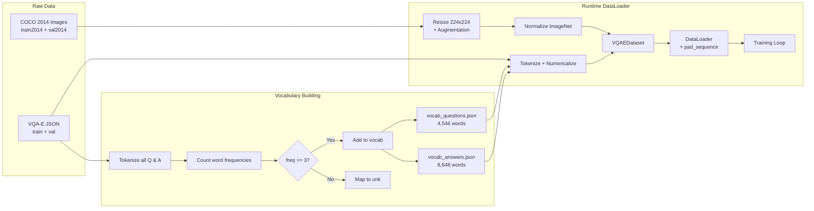

---

## 5. System Architecture Overview

All four models follow the **Encoder-Fusion-Decoder** paradigm, sharing the same high-level pipeline but differing in two key design choices:

| Model | Image Encoder | Attention | Parameters (approx.) |
|---|---|---|---|
| **A** | SimpleCNN (scratch) | No | ~46M |
| **B** | ResNet101 (pretrained) | No | ~83M |
| **C** | SimpleCNNSpatial (scratch) | Bahdanau Dual | ~58M |
| **D** | ResNetSpatialEncoder (pretrained) | Bahdanau Dual | ~96M |

### 5.1 High-Level Architecture Diagram

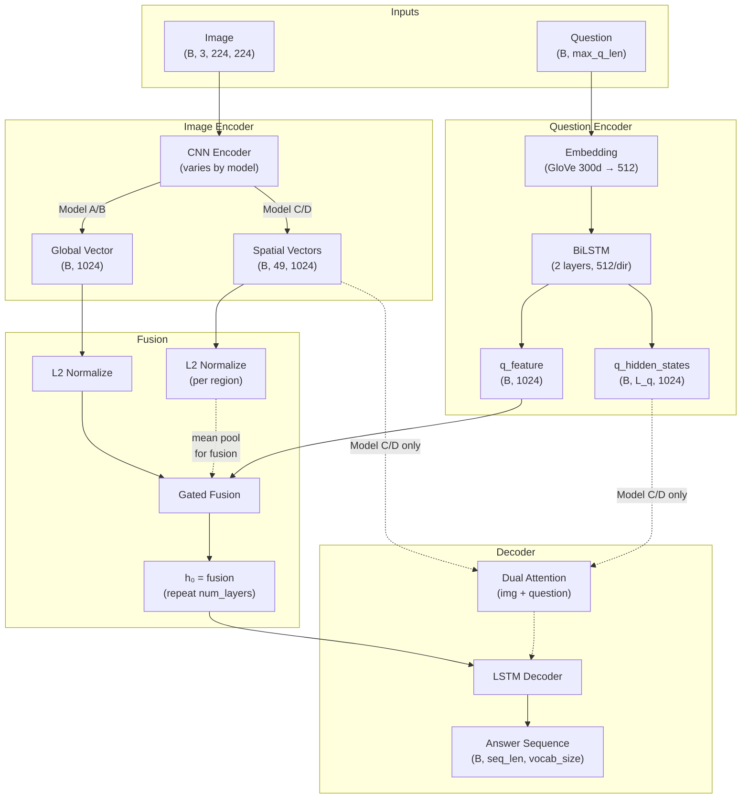

### 5.2 Key Design Decisions and Rationale

| Decision | Choice | Why Not the Alternative |
|---|---|---|
| **Fusion method** | Gated Fusion | Hadamard product treats both modalities equally; a learned gate adaptively weights image vs. question based on context |
| **L2 normalization** | Before fusion | Ensures the fusion gate operates on direction (semantic content), not magnitude (which varies between CNN and LSTM outputs) |
| **Decoder init** | $h_0 = \text{fusion}$, $c_0 = 0$ | Fusion vector carries combined multimodal information; zero cell state lets LSTM learn its own memory dynamics |
| **Teacher forcing** | Training only | Provides stable gradient signal; exposure bias is addressed in Phase 3 via scheduled sampling |
| **Autoregressive** | Inference only | Each token depends on all previous tokens; sequential generation required |

---

## 6. Model Architectures

### 6.1 Model A — Scratch CNN + LSTM Decoder (No Attention)

**Role:** Baseline — the simplest possible architecture with no pretrained weights and no attention.

```mermaid
graph TD
    subgraph Model A
        IMG["Image<br/>(B, 3, 224, 224)"] --> CONV1["Conv Block 1<br/>3→64, MaxPool"]
        CONV1 --> CONV2["Conv Block 2<br/>64→128, MaxPool"]
        CONV2 --> CONV3["Conv Block 3<br/>128→256, MaxPool"]
        CONV3 --> CONV4["Conv Block 4<br/>256→512, MaxPool"]
        CONV4 --> CONV5["Conv Block 5<br/>512→1024, MaxPool"]
        CONV5 --> POOL["AdaptiveAvgPool2d(1)"]
        POOL --> FC["Linear(1024→1024)"]
        FC --> L2["L2 Normalize"]

        Q["Question"] --> QENC["BiLSTM<br/>Q-Encoder"]
        QENC --> QF["q_feature (1024)"]

        L2 --> GATE["Gated Fusion"]
        QF --> GATE
        GATE --> INIT["h₀ for LSTM"]

        INIT --> LSTM["2-Layer LSTM<br/>(no attention)"]
        LSTM --> PROJ["out_proj → embed_size"]
        PROJ --> OUTPUT["Vocab Projection<br/>(weight tying)"]
    end
```

**Image Encoder: SimpleCNN**

A custom 5-layer CNN trained from scratch:

| Layer | Operation | Output Shape |
|---|---|---|
| Block 1 | Conv2d(3→64, k=3, p=1) → BN → ReLU → MaxPool(2) | $(B, 64, 112, 112)$ |
| Block 2 | Conv2d(64→128, k=3, p=1) → BN → ReLU → MaxPool(2) | $(B, 128, 56, 56)$ |
| Block 3 | Conv2d(128→256, k=3, p=1) → BN → ReLU → MaxPool(2) | $(B, 256, 28, 28)$ |
| Block 4 | Conv2d(256→512, k=3, p=1) → BN → ReLU → MaxPool(2) | $(B, 512, 14, 14)$ |
| Block 5 | Conv2d(512→1024, k=3, p=1) → BN → ReLU → MaxPool(2) | $(B, 1024, 7, 7)$ |
| Pool | AdaptiveAvgPool2d(1) | $(B, 1024, 1, 1)$ |
| FC | Linear(1024 → 1024) | $(B, 1024)$ |

**Why train from scratch?** Model A serves as the controlled baseline. By training the CNN from scratch, we can isolate the exact contribution of pretrained features when comparing A→B and C→D. Without this baseline, claims about transfer learning benefits would be unsubstantiated.

**Why 5 convolutional blocks?** Each block halves spatial resolution (MaxPool), going from $224 \times 224$ to $7 \times 7$. Five blocks are sufficient to capture hierarchical features (edges → textures → parts → objects) while keeping the model computationally manageable.

**Decoder:** LSTMDecoder (no attention) — receives the fused representation as initial hidden state and generates tokens autoregressively via teacher forcing.

**Limitations:**
- The entire image is compressed to a single 1024-dim vector (information bottleneck)
- No mechanism to focus on specific image regions relevant to the question
- CNN must learn visual features from scratch on VQA-E alone (~181K images, much smaller than ImageNet's 1.2M)

---

### 6.2 Model B — Pretrained ResNet101 + LSTM Decoder (No Attention)

**Role:** Isolates the effect of **pretrained features** by replacing the scratch CNN with ResNet101.

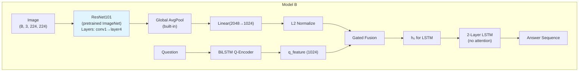

**Image Encoder: ResNetEncoder**

Uses a pretrained ResNet101 (ImageNet weights) with the final FC layer removed:

$$\text{ResNet101}[:-1] \rightarrow \text{Linear}(2048 \rightarrow 1024)$$

| Component | Details |
|---|---|
| Backbone | ResNet101 (pretrained on ImageNet, 1.2M images, 1000 classes) |
| Removed layers | Final FC layer (keeps avgpool) |
| Projection | Linear(2048 → 1024) |
| Initial state | `freeze=True` (all backbone parameters frozen) |
| Fine-tuning | `unfreeze_top_layers()` opens layer3 + layer4 (Phase 2) |

**Why ResNet101?**
- **Depth:** 101 layers provide rich hierarchical feature extraction (vs. ResNet50's 50 layers)
- **Transfer learning:** Pretrained on ImageNet (1.2M images, 1000 classes), the network has learned powerful visual representations that transfer well to VQA
- **Established baseline:** ResNet101 is the most commonly used backbone in VQA literature, enabling fair comparison with published results
- **Why not deeper (ResNet152)?** Diminishing returns; 152 layers need more VRAM with marginal accuracy gain on VQA tasks

**Selective Fine-tuning (Phase 2):**
- **Early layers (conv1, layer1, layer2):** remain frozen — capture generic low-level features (edges, textures, colors) that are task-independent
- **layer3 + layer4:** unfrozen with a smaller learning rate ($\text{lr} \times 0.1$) — these layers capture mid-to-high-level features that benefit from task-specific adaptation
- **Why not unfreeze all?** Full fine-tuning on a small dataset risks catastrophic forgetting of valuable ImageNet knowledge. Differential learning rates (10× lower for backbone) preserve low-level features while adapting high-level ones.

**Limitations:**
- Still uses a single global vector (no spatial information for decoder)
- More parameters (~83M vs ~46M) but most are frozen in Phase 1

---

### 6.3 Model C — Scratch CNN Spatial + Bahdanau Attention + LSTM Decoder

**Role:** Isolates the effect of **attention** by adding spatial attention to the scratch CNN baseline.

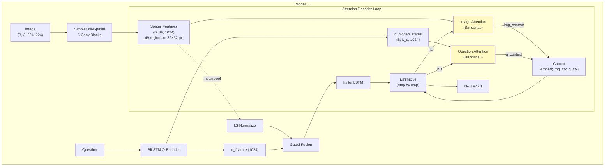

**Image Encoder: SimpleCNNSpatial**

Same 5-layer CNN as Model A, but **without** global average pooling — preserving spatial layout:

| Layer | Output Shape |
|---|---|
| 5× conv blocks | $(B, 1024, 7, 7)$ |
| Conv2d(1024→1024, k=1) — pointwise projection | $(B, 1024, 7, 7)$ |
| Flatten + Permute | $(B, 49, 1024)$ |

**Output:** $49$ spatial feature vectors $(B, 49, 1024)$, each representing a $32 \times 32$ pixel region in the original image.

**Why 49 regions?** The 5 pooling layers reduce the $224 \times 224$ input to $7 \times 7 = 49$ spatial positions. Each position has a receptive field of approximately $32 \times 32$ pixels, providing a coarse spatial grid. This is a natural consequence of the CNN architecture — no additional region proposal network is needed.

**Decoder: LSTMDecoderWithAttention — Dual Attention**

At each decode step $t$, the decoder performs **dual attention** — attending over both image regions and question hidden states:

**Step 1 — Image Attention (Bahdanau Additive Attention):**

$$e_{t,i}^{\text{img}} = \tanh(W_h \cdot h_{t-1} + W_{\text{img}} \cdot \text{img}_i)$$

$$\alpha_{t,i}^{\text{img}} = \text{softmax}(v^\top e_{t,i}^{\text{img}})$$

$$c_t^{\text{img}} = \sum_{i=1}^{49} \alpha_{t,i}^{\text{img}} \cdot \text{img}_i$$

**Step 2 — Question Attention:**

$$e_{t,j}^{q} = \tanh(W_h' \cdot h_{t-1} + W_q \cdot q_j)$$

$$\alpha_{t,j}^{q} = \text{softmax}(v'^\top e_{t,j}^{q})$$

$$c_t^{q} = \sum_{j=1}^{L_q} \alpha_{t,j}^{q} \cdot q_j$$

**Step 3 — LSTM Input (concatenated):**

$$\text{input}_t = [\text{embed}(a_{t-1}) \; ; \; c_t^{\text{img}} \; ; \; c_t^{q}]$$

$$h_t, c_t = \text{LSTM}(\text{input}_t, h_{t-1}, c_{t-1})$$

$$P(a_t) = \text{softmax}(W_o \cdot \text{proj}(h_t))$$

Where $[\cdot ; \cdot]$ denotes concatenation, so the LSTM input size is $\text{embed\_size} + 2 \times \text{hidden\_size} = 512 + 2 \times 1024 = 2560$.

**Why Bahdanau Attention (not Luong)?**
- **Bahdanau (additive):** $e = v^\top \tanh(W_h h + W_s s)$ — uses a learned hidden layer to combine query and key. Works well with LSTMs because the tanh non-linearity matches the LSTM's activation functions.
- **Luong (dot-product):** $e = h^\top s$ — simpler but assumes query and key live in the same space, which is not true when attending over CNN features with LSTM states. Since our image spatial features and LSTM hidden states have different learned representations, additive attention is more appropriate.

**Why Dual Attention (image + question)?**
At each generation step, the decoder needs to know:
1. **Which image regions** are relevant to the current word being generated
2. **Which question words** are most important for context

Single (image-only) attention misses question context. For example, when generating "because the dog is running," the decoder needs to attend to "dog" and "running" regions in the image while also re-reading relevant question words like "what is the dog doing."

**Coverage Mechanism (Optional):**

To prevent the attention from repeatedly focusing on the same image regions, an optional **Coverage Mechanism** (See et al., 2017) is supported:

$$\text{coverage}_t = \sum_{\tau=0}^{t-1} \alpha_\tau^{\text{img}}$$

The coverage vector is fed into the attention energy computation:

$$e_{t,i}^{\text{img}} = \tanh(W_h \cdot h_{t-1} + W_{\text{img}} \cdot \text{img}_i + W_{\text{cov}} \cdot \text{coverage}_{t,i})$$

Coverage loss penalizes re-attending:

$$\mathcal{L}_{\text{cov}} = \frac{1}{T} \sum_{t=1}^{T} \sum_{i=1}^{49} \alpha_{t,i} \cdot \log(\text{coverage}_{t,i} + 1)$$

**Total loss:**

$$\mathcal{L} = \mathcal{L}_{\text{CE}} + \lambda \cdot \mathcal{L}_{\text{cov}}$$

where $\lambda = 1.0$ by default.

**Why Coverage?** Without coverage, the attention tends to "get stuck" on the most salient image region (e.g., the largest object) across all decode steps. Coverage encourages the model to broaden its visual grounding, producing answers that reference multiple visual elements. This is especially important for explanatory answers where different parts of the explanation may reference different objects or attributes.

**Characteristics:**
- Preserves spatial information (49 regions instead of 1 vector)
- Dual attention dynamically focuses on relevant image regions AND question words
- Richer decoder input at each step (2560-dim vs. 512-dim for non-attention models)
- More parameters in the decoder (~35M vs ~22M)

---

### 6.4 Model D — Pretrained ResNet101 Spatial + Bahdanau Attention + LSTM Decoder

**Role:** Combines **both** advantages — pretrained features AND attention. Expected to be the strongest model.

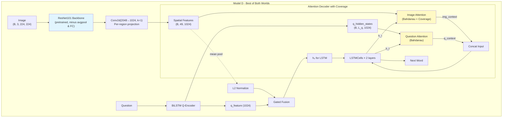

**Image Encoder: ResNetSpatialEncoder**

Uses ResNet101 pretrained on ImageNet, with both avgpool and FC removed to preserve spatial feature maps:

$$\text{ResNet101}[:-2] \rightarrow \text{Conv2d}(2048 \rightarrow 1024, k=1) \rightarrow \text{reshape} \rightarrow (B, 49, 1024)$$

| Component | Details |
|---|---|
| Backbone | ResNet101 (pretrained, features `[:-2]`) |
| Projection | Conv2d(2048→1024, kernel=1) — per-region dimensionality reduction |
| Fine-tuning | Same as Model B: `unfreeze_top_layers()` for Phase 2 |

**Output:** $49$ spatial feature vectors $(B, 49, 1024)$ — each backed by ResNet's powerful hierarchical representations.

**Decoder:** Same `LSTMDecoderWithAttention` as Model C (dual attention + coverage).

**Why is Model D expected to be the best?**
1. **Pretrained features:** ResNet101's features capture rich visual semantics (objects, parts, textures) learned from 1.2M ImageNet images, far more than our 181K VQA-E images
2. **Spatial preservation:** Unlike Model B's global vector, the 49 spatial regions allow attention to selectively focus on relevant areas
3. **Dual attention:** The decoder can re-read both the image and question at each generation step, adapting its focus as the answer unfolds
4. **Synergy:** Attention over pretrained features should be more effective than attention over scratch features, because the underlying representations are more semantically meaningful

**Trade-offs:**
- Highest computational cost (large backbone + per-step attention loop)
- Smallest batch size (16 due to VRAM; compensated by gradient accumulation)
- Slowest training (~4× slower than Model A per epoch)

---

### 6.5 Model Comparison Matrix

| Feature | Model A | Model B | Model C | Model D |
|---|---|---|---|---|
| CNN | SimpleCNN | ResNet101 | SimpleCNNSpatial | ResNet101Spatial |
| CNN pretrained? | No | Yes (ImageNet) | No | Yes (ImageNet) |
| Image feature shape | (B, 1024) | (B, 1024) | (B, 49, 1024) | (B, 49, 1024) |
| Attention? | No | No | Bahdanau Dual | Bahdanau Dual |
| Coverage? | N/A | N/A | Yes | Yes |
| Fine-tunable backbone? | N/A | Yes (Phase 2) | N/A | Yes (Phase 2) |
| Decoder input size | 512 | 512 | 2560 | 2560 |
| Approx. parameters | ~46M | ~83M | ~58M | ~96M |
| Batch size (RTX 3060) | 64 | 32 | 32 | 16 |
| Role | Baseline | +Pretrained | +Attention | +Both |

---

## 7. Shared Components

### 7.1 Question Encoder (BiLSTM)

All four models share the same **Bidirectional LSTM** question encoder:

$$\text{Embedding}(V_Q, d_{\text{embed}}) \rightarrow \text{BiLSTM}(\text{hidden\_size} // 2 \text{ per direction}) \rightarrow h_{\text{final}}$$

| Parameter | Value |
|---|---|
| Embedding dim | 300 (GloVe) → projected to 512 |
| LSTM hidden size | 512 per direction (1024 total) |
| Num layers | 2 |
| Dropout | 0.5 (inter-layer) |
| Bidirectional | Yes |

**Why BiLSTM (not unidirectional)?** A question like *"What color is the dog on the left?"* reveals its true intent only at the end ("on the left"). A unidirectional LSTM reading left-to-right encodes "color" without knowing the full context. A BiLSTM captures both forward and backward dependencies:

$$\overrightarrow{h}_t = \text{LSTM}_{\rightarrow}(x_t, \overrightarrow{h}_{t-1}), \quad \overleftarrow{h}_t = \text{LSTM}_{\leftarrow}(x_t, \overleftarrow{h}_{t+1})$$

$$h_t = [\overrightarrow{h}_t \; ; \; \overleftarrow{h}_t] \quad \text{(concatenated)}$$

**Outputs:**
- $q_{\text{feature}} = [\overrightarrow{h_L} \; ; \; \overleftarrow{h_L}] \in \mathbb{R}^{1024}$ — final hidden state for fusion
- $q_{\text{hidden\_states}} \in \mathbb{R}^{B \times L_q \times 1024}$ — all timestep outputs for question attention (used only by Model C/D)

### 7.2 Gated Fusion

**Why not simple concatenation or Hadamard product?**

| Fusion Method | Formula | Limitation |
|---|---|---|
| Concatenation | $[f_{\text{img}} ; f_q]$ | Doubles dimension; no interaction modeling |
| Hadamard product | $f_{\text{img}} \odot f_q$ | Treats both modalities equally; no adaptivity |
| **Gated Fusion (ours)** | $g \odot h_{\text{img}} + (1-g) \odot h_q$ | **Learnable gate** adapts per-dimension weighting |

The Gated Fusion module learns to combine image and question information adaptively:

$$h_{\text{img}} = \tanh(W_{\text{img}} \cdot f_{\text{img}})$$

$$h_q = \tanh(W_q \cdot f_q)$$

$$g = \sigma(W_g \cdot [f_{\text{img}} \; ; \; f_q])$$

$$\text{fusion} = g \odot h_{\text{img}} + (1 - g) \odot h_q$$

where $g \in [0, 1]^{d}$ is a learned gate vector, and $\sigma$ is the sigmoid function.

**Why this matters:** For questions like *"What is in the image?"* the gate should heavily weight the image representation. For questions like *"Is this a kitchen or bedroom?"* the gate should weight both modalities. The gate learns this automatically from data.

### 7.3 GloVe Pretrained Embeddings

**Why GloVe (not random initialization)?**

| Initialization | Advantage | Disadvantage |
|---|---|---|
| Random | No external dependency | Must learn word semantics from VQA-E alone (~181K samples) |
| **GloVe 6B 300d** | Semantic knowledge from 6B tokens (Wikipedia + Gigaword) | Fixed dimension (300), may not capture VQA-specific semantics |

Using GloVe embeddings provides the model with pre-existing knowledge of word relationships (e.g., "dog" ≈ "puppy", "red" ≈ "scarlet") without needing to learn these from the relatively small VQA-E corpus.

**Implementation details:**
- Words found in GloVe → use pretrained vectors (fine-tuned during training)
- Words not found (OOV) → randomly initialized from $\mathcal{N}(0, 0.1)$
- `<pad>` embedding → zero vector (never updated)
- When GloVe dim (300) ≠ embed_size (512), a learned linear projection is added

**Coverage:** ~99.6% of answer vocabulary words are found in GloVe — extremely high coverage.

### 7.4 Weight Tying

The decoder output layer shares weights with the embedding layer (Press & Wolf, 2017):

$$\text{hidden} \xrightarrow{\text{out\_proj}} \mathbb{R}^{d_{\text{embed}}} \xrightarrow{W_{\text{embed}}^\top} \mathbb{R}^{|V_A|}$$

**Why weight tying?**
1. **Parameter reduction:** Eliminates a separate $d_{\text{embed}} \times |V_A|$ output matrix
2. **Regularization effect:** Forces the output distribution to be consistent with the input embedding space
3. **Semantic coherence:** The model predicts words "in the same space" it reads them, encouraging consistent representations

> **Important:** When GloVe embeddings are used (dim=300), weight tying is **disabled** to avoid a severe bottleneck ($1024 \rightarrow 300 \rightarrow 8648$). The 300-dim GloVe space is too narrow for the output projection, degrading generation quality.

---

## 8. Training Pipeline

### 8.1 Why Three-Phase Training?

The three-phase progressive training strategy is the result of careful reasoning about the learning dynamics of multimodal models with pretrained components:

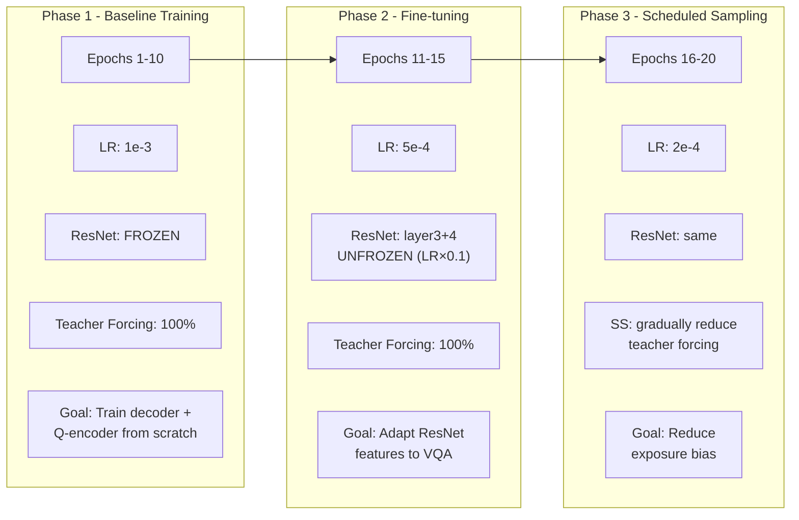

**Why not train everything from the start?**

Each phase addresses a specific challenge:

| Phase | Challenge Addressed | Why This Order? |
|---|---|---|
| **Phase 1** | Decoder hasn't learned basic language generation yet | If we unfreeze ResNet now, its gradients from a random decoder would corrupt pretrained features |
| **Phase 2** | Generic ImageNet features may not capture VQA-specific patterns | Now that the decoder is stable, ResNet gradients are meaningful and can adapt features constructively |
| **Phase 3** | Teacher forcing creates train/test discrepancy (exposure bias) | Now that both encoder and decoder are well-trained, scheduled sampling fine-tunes the model to handle its own mistakes |

**Analogy:** Phase 1 is like teaching a student to write sentences. Phase 2 is like giving them better reference materials (adapted visual features). Phase 3 is like having them practice writing without looking at the answer key.

### 8.2 Phase 1 — Baseline Training (Epochs 1–10)

| Setting | Value | Rationale |
|---|---|---|
| Learning rate | $1 \times 10^{-3}$ | Standard initial LR for Adam |
| ResNet backbone | **Frozen** (Models B/D) | Protects pretrained weights while decoder learns |
| Decoder | Teacher Forcing (100%) | Stable training signal for from-scratch decoder |
| LR warmup | First 3 epochs (linear from lr/10) | Prevents early instability from large gradients |
| LR schedule | Cosine annealing after warmup | Smooth decay for stable convergence |
| Duration | 10 epochs | Sufficient for decoder convergence |

**Teacher Forcing Detail:**

$$\text{decoder\_input} = \text{answer}[:, :-1] = [\texttt{<start>}, w_1, w_2, \dots, w_{n}]$$

$$\text{decoder\_target} = \text{answer}[:, 1:] = [w_1, w_2, \dots, w_{n}, \texttt{<end>}]$$

$$\mathcal{L}_{\text{CE}} = \text{CrossEntropyLoss}(\text{logits}, \text{target}), \quad \text{ignore\_index} = 0 \; (\texttt{<pad>})$$

### 8.3 Phase 2 — Fine-tuning (Epochs 11–15)

| Setting | Value | Rationale |
|---|---|---|
| Learning rate | $5 \times 10^{-4}$ | Lower than Phase 1 to avoid destabilizing converged modules |
| ResNet backbone | **Unfrozen** — layer3 + layer4 (B/D) | High-level features benefit from VQA-specific adaptation |
| Differential LR | Backbone at $\text{lr} \times 0.1 = 5 \times 10^{-5}$ | 10× lower prevents catastrophic forgetting |
| Models A/C | Continue training (no architectural change) | Fair comparison — same total epochs |
| Duration | 5 epochs | Brief adaptation window; longer risks forgetting |

**Why differential learning rate?**

| Parameter Group | Learning Rate | Reasoning |
|---|---|---|
| Decoder + Q-Encoder + Fusion | $5 \times 10^{-4}$ | Already trained from scratch; can adapt quickly |
| ResNet layer3 + layer4 | $5 \times 10^{-5}$ | Pretrained knowledge is valuable; gentle adaptation |
| ResNet conv1 + layer1 + layer2 | Frozen ($0$) | Low-level features (edges, textures) are universal |

### 8.4 Phase 3 — Scheduled Sampling (Epochs 16–20)

**The Exposure Bias Problem:**

During training with teacher forcing, the decoder always receives the **ground-truth** previous token. During inference, it receives its own **predicted** token. If the model makes an error at step $t$, all subsequent steps see an input distribution they never encountered during training — errors compound.

**Solution: Scheduled Sampling (Bengio et al., 2015)**

At each decode step $t$, with probability $\epsilon$, use the ground-truth token; with probability $(1 - \epsilon)$, use $\arg\max(\text{logit}_{t-1})$.

The probability follows an **inverse-sigmoid decay**:

$$\epsilon(\text{epoch}) = \frac{k}{k + \exp(\text{epoch} / k)}, \quad k = 5$$

| Epoch (within Phase 3) | $\epsilon$ (approx.) | Behavior |
|---|---|---|
| 1 | ~0.83 | Mostly teacher forcing |
| 3 | ~0.73 | Mixed |
| 5 | ~0.65 | More self-reliant |

**Why not start scheduled sampling from epoch 1?** The decoder must first learn basic language patterns (Phase 1) and receive adapted features (Phase 2). Applying scheduled sampling too early — when the model's predictions are mostly random — just adds noise to training without benefit.

### 8.5 Learning Rate Schedule Detail

**LR Warmup (Phase 1, first 3 epochs):**

$$\text{lr}(e) = \text{lr}_{\text{base}} \times \left(0.1 + 0.9 \times \frac{e}{3}\right), \quad e \in [1, 3]$$

**Why warmup?** Adam's adaptive learning rate estimates are unreliable in the first few steps (based on very few gradient observations). A linear warmup starts with a conservative LR and ramps up, preventing early instability.

**Cosine Annealing (after warmup):**

$$\text{lr}(e) = \eta_{\min} + \frac{1}{2}(\text{lr}_{\text{base}} - \eta_{\min})\left(1 + \cos\left(\frac{e - e_{\text{warmup}}}{T_{\max}} \pi\right)\right)$$

**Why cosine (not step decay)?** Cosine annealing provides a smooth, continuous decay without abrupt LR drops. Step decay (dividing LR by 10 at fixed epochs) causes sudden training instability. Cosine annealing has been shown to produce better final convergence in deep learning.

### 8.6 Batch Sizes (RTX 3060 12GB VRAM)

| Model | Batch Size | Accumulation Steps | Effective Batch | Why This Size |
|---|---|---|---|---|
| A (SimpleCNN) | 64 | 2 | 128 | Lightweight model, fits easily |
| B (ResNet101) | 32 | 4 | 128 | ResNet intermediate activations consume VRAM |
| C (SimpleCNN + Attn) | 32 | 2 | 64 | Attention loop stores 49 attention maps per step |
| D (ResNet101 + Attn) | 16 | 4 | 64 | Largest model; attention + ResNet activations |

### 8.7 Training Process Flow

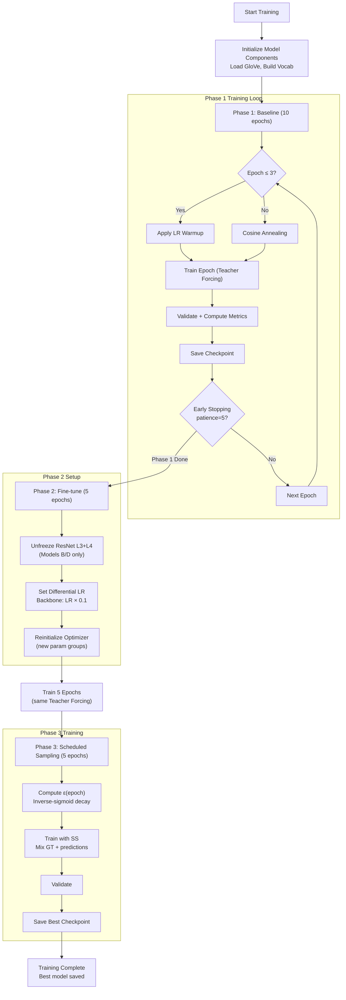

---

## 9. Key Architectural Improvements

This section details the **11 architectural and training improvements** implemented beyond a basic seq2seq VQA model, with rationale for each.

### 9.1 Label Smoothing

| Property | Value |
|---|---|
| **What** | Softens one-hot targets: $y_{\text{smooth}} = (1-\alpha) \cdot y_{\text{onehot}} + \alpha / K$ |
| **Configuration** | $\alpha = 0.1$, applied in `CrossEntropyLoss(label_smoothing=0.1)` |
| **Why** | Prevents the model from becoming overconfident (outputting probabilities close to 1.0 for the correct token). Overconfident models generalize poorly because they overfit to the exact training distribution. Label smoothing encourages the model to maintain a "softer" probability distribution, improving calibration. |
| **Impact** | Better generalization, slightly lower training accuracy but higher validation metrics |

### 9.2 Bidirectional LSTM (BiLSTM)

| Property | Value |
|---|---|
| **What** | Question encoder reads the question in both directions simultaneously |
| **Configuration** | 2-layer BiLSTM, 512 hidden per direction (1024 total) |
| **Why** | Questions are free-form natural language where meaning depends on context from both sides. "What color is the **big** dog?" — the adjective "big" is only meaningful once you know the noun "dog" appears later. A unidirectional LSTM encodes "big" without this context. BiLSTM captures both forward ("what color...") and backward ("...big dog") context. |
| **Impact** | Richer question representations, especially for long or complex questions |

### 9.3 Gated Fusion

| Property | Value |
|---|---|
| **What** | Learnable gate combines image and question features adaptively |
| **Configuration** | $g = \sigma(W_g \cdot [f_{\text{img}} ; f_q])$ with $g \in [0,1]^{1024}$ |
| **Why** | Different questions require different amounts of visual vs. linguistic information. "What is this?" → heavily weight image. "Is this a cat or a dog?" → balance both. Simple fusion methods (concatenation, Hadamard product) treat both modalities equally. The gated approach learns per-dimension weighting from data. |
| **Impact** | Adaptive modality balancing; each dimension independently decides the image-question mix |

### 9.4 Dual Attention (Image + Question)

| Property | Value |
|---|---|
| **What** | Decoder attends to both spatial image features (49 regions) and question hidden states at each generation step |
| **Configuration** | Two parallel Bahdanau attention modules; output concatenated with embedding |
| **Why** | Generating explanatory answers requires grounding different parts of the answer in different image regions and question words. When generating "the cat is sitting on the couch because it looks comfortable," the decoder should attend to: (1) "cat" region, (2) "couch" region, (3) question words "why" and "sitting". Single attention (image-only) misses question context; no attention uses a static global vector. |
| **Impact** | Significantly richer decoder context; enables spatial grounding of answers |

### 9.5 Learning Rate Warmup

| Property | Value |
|---|---|
| **What** | Linear warmup from $\text{lr}/10$ to $\text{lr}$ over the first 3 epochs |
| **Configuration** | Phase 1 only: epochs 1→3 linear ramp |
| **Why** | Adam optimizer's second-moment estimates ($v_t$) need several hundred gradient updates to stabilize. In the first few batches, these estimates are based on very few observations, making the adaptive learning rate unreliable. Starting with a low LR and ramping up gives the optimizer time to calibrate before applying full-strength updates. This is especially important for models with multiple components (CNN + LSTM + Fusion) where gradient magnitudes vary widely. |
| **Impact** | Prevents early training instability; smoother convergence curves |

### 9.6 GloVe Pretrained Embeddings

| Property | Value |
|---|---|
| **What** | Initialize word embeddings with GloVe 6B 300d vectors |
| **Configuration** | Fine-tuned during training; OOV words initialized from $\mathcal{N}(0, 0.1)$; `<pad>` fixed at zero |
| **Why** | The VQA-E dataset has ~181K training samples — not enough to learn high-quality word embeddings from scratch for a vocabulary of 8,648+ words. GloVe embeddings, trained on 6 billion tokens from Wikipedia and Gigaword, provide pre-existing semantic knowledge: "dog" and "puppy" start close in embedding space, "red" and "blue" are equidistant from "color", etc. This gives the model a strong initialization that accelerates convergence. |
| **Impact** | ~99.6% vocabulary coverage; faster convergence; better word-level semantics |

### 9.7 Weight Tying

| Property | Value |
|---|---|
| **What** | Decoder's output projection matrix shares weights with the embedding matrix |
| **Configuration** | `output_layer.weight = embed.weight`; disabled when using GloVe (300d too narrow) |
| **Why** | The embedding matrix maps words → vectors, and the output matrix maps vectors → word probabilities. Conceptually, both operate in the same semantic space. Sharing weights (Press & Wolf, 2017) enforces this consistency: a word that has a specific embedding should also have a predictable output probability pattern. This acts as a strong regularizer and reduces the total parameter count. |
| **Impact** | Fewer parameters, improved generalization, more consistent word representations |

### 9.8 BERTScore Evaluation

| Property | Value |
|---|---|
| **What** | Evaluate generation quality using contextual BERT embeddings |
| **Configuration** | Using `bert_score` library with default BERT model |
| **Why** | Traditional n-gram metrics (BLEU, METEOR) fail to capture semantic similarity. "The dog is playing in the park" and "A puppy plays in the garden" have low n-gram overlap but very high semantic overlap. BERTScore computes cosine similarity between contextual embeddings (not just surface forms), providing a more meaningful quality signal. This is especially important for explanatory answers where paraphrasing is common. |
| **Impact** | More robust evaluation that captures semantic quality beyond surface overlap |

### 9.9 Coverage Mechanism

| Property | Value |
|---|---|
| **What** | Tracks cumulative attention over image regions across decode steps; penalizes re-attending |
| **Configuration** | Coverage vector $= \sum_{\tau < t} \alpha_\tau$; coverage loss weight $\lambda = 1.0$ |
| **Why** | Without coverage, the attention mechanism tends to "get stuck" — repeatedly attending to the most salient image region (usually the largest or most prominent object). For explanatory answers that reference multiple visual elements ("the dog is sitting on the grass near a tree"), the decoder needs to shift attention across different regions. Coverage provides this signal by making it increasingly expensive to re-attend to already-visited regions. Originally proposed for summarization (See et al., 2017), this is equally applicable to image-grounded generation. |
| **Impact** | More diverse attention patterns; answers reference multiple visual elements |

### 9.10 N-gram Blocking (Beam Search)

| Property | Value |
|---|---|
| **What** | Prevents repeated trigrams during beam search decoding |
| **Configuration** | Default $n = 3$; sets log probability to $-\infty$ for tokens that would create a repeated trigram |
| **Why** | Beam search, while finding higher-probability sequences than greedy decoding, has a well-known tendency to produce repetitive text (e.g., "the cat is sitting on the cat is sitting on the..."). N-gram blocking eliminates this by making it impossible to repeat any 3-gram within a single generated sequence. This is a hard constraint (not a soft penalty), ensuring zero repetition. |
| **Impact** | Eliminates repetitive generation in beam search; cleaner output |

### 9.11 Gradient Accumulation

| Property | Value |
|---|---|
| **What** | Accumulate gradients over multiple mini-batches before updating parameters |
| **Configuration** | Model-dependent: 2–4 accumulation steps (see batch size table) |
| **Why** | The RTX 3060 (12GB VRAM) limits physical batch sizes, especially for Model D (16). However, very small effective batches lead to noisy gradient estimates and unstable training. Gradient accumulation simulates larger batches by summing gradients across multiple forward passes before calling `optimizer.step()`. Loss is divided by `accum_steps` to maintain correct gradient magnitude. |
| **Impact** | Effective batch sizes of 64–128 despite limited VRAM; more stable training |

---

## 10. Optimization Techniques

### 10.1 Regularization

| Technique | Configuration | Why |
|---|---|---|
| **Label Smoothing** | 0.1 | Prevents overconfidence, improves calibration (see §9.1) |
| **Weight Decay** | $1 \times 10^{-5}$ | L2 regularization; prevents large weight magnitudes |
| **Embedding Dropout** | 0.5 | Prevents co-adaptation of embedding dimensions |
| **LSTM Inter-layer Dropout** | 0.5 | Regularizes between stacked LSTM layers |
| **Gradient Clipping** | max_norm = 5.0 | Prevents exploding gradients, especially during early training |
| **Early Stopping** | patience = 5 | Halts training when validation loss stops improving for 5 consecutive epochs |

**Why such aggressive dropout (0.5)?** VQA-E has 181K training samples — a moderate dataset size for a model with 46–96M parameters. Higher dropout compensates for the relative data scarcity and prevents overfitting. The 0.5 rate is the value recommended in the original LSTM dropout paper (Zaremba et al., 2014).

### 10.2 Mixed Precision Training (AMP)

| GPU Type | Precision | GradScaler | Why |
|---|---|---|---|
| **Ampere+** (≥ compute 8.0) | BFloat16 | Not needed | BF16 has the same exponent range as FP32, so no overflow issues |
| **Older GPUs** | Float16 | Yes | FP16 has narrow dynamic range; GradScaler prevents underflow |

**Why AMP?** Reduces memory usage by ~40% and speeds up computation by ~30–50% on modern GPUs, with negligible impact on model quality. This is critical for fitting Model D (the largest) on the RTX 3060.

**Detection:** Automatic via `torch.cuda.get_device_capability()` — the RTX 3060 (compute 8.6) uses BF16.

### 10.3 Gradient Accumulation (Detail)

$$\text{effective batch} = \text{batch\_size} \times \text{accum\_steps}$$

Loss is divided by `accum_steps` before `backward()`, and `optimizer.step()` is called every `accum_steps` mini-batches. This ensures the gradient statistics match what would be obtained with a single large batch.

### 10.4 GPU Optimizations

| Optimization | Description | Why |
|---|---|---|
| `cudnn.benchmark = True` | Auto-tune convolution algorithms | Our input size is fixed at 224×224; cuDNN caches the fastest algorithm |
| TF32 matmul & convolutions | Uses TensorFloat-32 on Ampere+ | ~2× faster than FP32, maintains near-FP32 accuracy |
| Fused Adam optimizer | Single CUDA kernel for Adam update | Reduces kernel launch overhead (~10–20% faster) |
| `pin_memory=True` | Pins DataLoader output in page-locked memory | Faster CPU→GPU transfer via DMA |
| `persistent_workers=True` | DataLoader workers persist across epochs | Avoids costly respawning (process creation + data loading) |
| `prefetch_factor=4` | Pre-loads 4 batches ahead | Overlaps data loading with GPU computation |

---

## 11. Inference & Decoding

### 11.1 Inference Pipeline

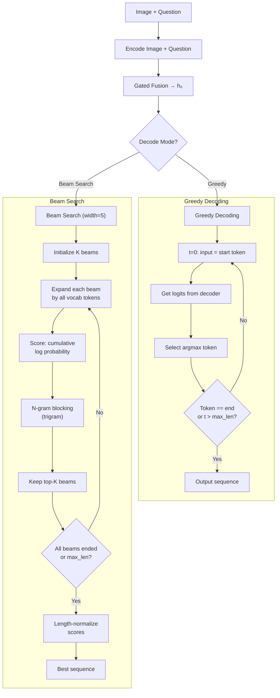

### 11.2 Greedy Decoding

At each step, select the token with the highest probability:

$$a_t = \arg\max_{w \in V_A} P(w \mid a_{<t}, I, Q)$$

- **Advantage:** Fast single-pass decoding (one forward pass per token)
- **Disadvantage:** May miss globally optimal sequences — a locally suboptimal token choice can lead to a better overall sequence

### 11.3 Beam Search

Maintains the top-$k$ candidate sequences at each step:

1. Expand each beam by all vocabulary tokens
2. Score each candidate by cumulative log probability
3. Apply n-gram blocking (discard candidates that repeat trigrams)
4. Keep top-$k$ candidates
5. Return the sequence with the highest **length-normalized** score:

$$\text{score}(A) = \frac{1}{|A|} \sum_{t=1}^{|A|} \log P(a_t \mid a_{<t}, I, Q)$$

**Why length normalization?** Without it, beam search strongly favors shorter sequences (fewer log-probability terms to sum). Length normalization ensures fair comparison between sequences of different lengths.

### 11.4 N-gram Blocking

To prevent repetitive output during beam search, trigram blocking sets $\log P(w) = -\infty$ for any token $w$ that would create a repeated n-gram (default: $n = 3$).

**Example:** If the beam contains "the cat is sitting on the cat is", any token $w$ that forms a trigram already seen (e.g., "sitting" → "is sitting on") is blocked.

---

## 12. Evaluation Metrics

### 12.1 Metric Selection Rationale

**Why multiple metrics?** No single metric captures all aspects of generation quality. BLEU measures surface-level n-gram overlap, METEOR adds synonym awareness, and BERTScore captures deep semantic similarity. Using all three provides a comprehensive picture.

| Metric | Type | What It Measures | Expected Range | Strength | Weakness |
|---|---|---|---|---|---|
| **BLEU-4** ★ | N-gram precision | 4-gram overlap between prediction and reference | 0.05 – 0.20 | Standard benchmark metric | Ignores synonyms and paraphrases |
| **METEOR** ★ | Semantic matching | N-gram + stem + synonym matching via WordNet | 0.10 – 0.30 | Captures paraphrases | Requires WordNet; English-only |
| **BERTScore** ★ | Semantic similarity | Cosine similarity of BERT contextual embeddings | 0.40 – 0.70 | Captures deep semantic meaning | Computationally expensive |
| BLEU-1 | Unigram precision | Word-level overlap | Reference | Simple word coverage | No word order sensitivity |
| BLEU-2 | Bigram precision | Phrase-level overlap | Reference | Basic phrase matching | |
| BLEU-3 | Trigram precision | Longer phrase overlap | Reference | | |
| Exact Match | String equality | Strict character-level match | < 5% | Definitive correctness | Far too strict for generative tasks |

★ = Primary metrics for evaluation and comparison.

### 12.2 Why Not VQA Accuracy?

Traditional VQA Accuracy (classification-based) counts exact matches against ground-truth answer pools. This is designed for short classification answers and is **not suitable** for evaluating generative outputs of varying length and structure. A generated explanation "yes, the dog is running on the grass" would score 0% VQA Accuracy even though it correctly answers the question.

---

## 13. Hyperparameters Summary

### 13.1 Model Hyperparameters

| Hyperparameter | Value | Applies To | Rationale |
|---|---|---|---|
| `hidden_size` | 1024 | All components | Standard choice balancing capacity and efficiency |
| `embed_size` | 512 | Q-Encoder, Decoder | Larger than GloVe's 300d to allow richer learned representations |
| `num_layers` (LSTM) | 2 | Q-Encoder, Decoder | 1 layer is too shallow; 3+ adds parameters without clear benefit on this task |
| `dropout` | 0.5 | Embedding, LSTM | Strong regularization for moderate dataset size |
| `vocab_size_q` | 4,546 | Q-Encoder | Built from VQA-E training set (threshold=3) |
| `vocab_size_a` | 8,648 | Decoder | Built from VQA-E training set (threshold=3) |
| `max_q_len` | Dynamic | DataLoader | Padded to longest in batch (no truncation) |
| `max_a_len` | Dynamic | DataLoader | Padded to longest in batch |

### 13.2 Training Hyperparameters

| Hyperparameter | Phase 1 | Phase 2 | Phase 3 | Rationale |
|---|---|---|---|---|
| Learning rate | $1 \times 10^{-3}$ | $5 \times 10^{-4}$ | $2 \times 10^{-4}$ | Progressive decay: fast initial learning → gentle refinement |
| Backbone LR ratio | N/A | $\times 0.1$ | $\times 0.1$ | Protects pretrained knowledge |
| Optimizer | AdamW | AdamW | AdamW | Adam with decoupled weight decay; fused variant for speed |
| Weight decay | $1 \times 10^{-5}$ | $1 \times 10^{-5}$ | $1 \times 10^{-5}$ | Light L2 regularization |
| Label smoothing | 0.1 | 0.1 | 0.1 | Consistent regularization across phases |
| Gradient clipping | 5.0 | 5.0 | 5.0 | Prevents exploding gradients |
| LR warmup epochs | 3 | — | — | Stabilizes early training |
| LR schedule | Cosine annealing | Cosine annealing | Cosine annealing | Smooth decay |
| $\eta_{\min}$ | $0.01 \times \text{lr}$ | $0.01 \times \text{lr}$ | $0.01 \times \text{lr}$ | Minimum LR floor |
| SS decay $k$ | — | — | 5 | Controls scheduled sampling rate |
| Coverage $\lambda$ | 1.0 | 1.0 | 1.0 | Weight for coverage loss (Models C/D) |
| Early stopping patience | 5 | 5 | 5 | Epochs without improvement before stopping |

### 13.3 Hardware & System

| Parameter | Value |
|---|---|
| GPU | NVIDIA RTX 3060 (12GB VRAM) |
| GPU Compute Capability | 8.6 (Ampere) |
| AMP Precision | BFloat16 |
| DataLoader workers | 4 |
| Prefetch factor | 4 |
| Pin memory | Yes |
| cuDNN benchmark | Yes |
| TF32 | Enabled |

---

## 14. Parameter Count & Complexity

### 14.1 Component-Level Parameter Counts (Approximate)

| Component | Parameters (approx.) | Notes |
|---|---|---|
| **SimpleCNN** | ~7.3M | 5 conv blocks + FC |
| **SimpleCNNSpatial** | ~7.3M | 5 conv blocks + 1×1 conv (same total) |
| **ResNetEncoder** | ~44.6M | ResNet101 backbone + Linear(2048→1024) |
| **ResNetSpatialEncoder** | ~44.6M | ResNet101 backbone + Conv2d(2048→1024, 1×1) |
| **QuestionEncoder (BiLSTM)** | ~12M | Embedding + 2-layer BiLSTM (shared) |
| **GatedFusion** | ~4.2M | 3 linear layers (shared) |
| **LSTMDecoder (no attention)** | ~22M | Embedding + 2-layer LSTM + output |
| **LSTMDecoderWithAttention** | ~35M | Above + 2× Bahdanau attention + larger LSTM input |

### 14.2 Total Model Parameters

| Model | Encoder | Decoder | Shared | Total (approx.) | Trainable Phase 1 | Trainable Phase 2 |
|---|---|---|---|---|---|---|
| **A** | 7.3M | 22M | 16.2M | **~46M** | 46M (all) | 46M (all) |
| **B** | 44.6M | 22M | 16.2M | **~83M** | ~40M (ResNet frozen) | ~83M (all) |
| **C** | 7.3M | 35M | 16.2M | **~58M** | 58M (all) | 58M (all) |
| **D** | 44.6M | 35M | 16.2M | **~96M** | ~53M (ResNet frozen) | ~96M (all) |

> **Note:** "Shared" = QuestionEncoder (~12M) + GatedFusion (~4.2M). Parameter counts are approximate; exact values can be obtained via `torchsummary` or `model.parameters()`.

### 14.3 Computational Complexity (Approximate)

| Model | CNN FLOPs | Attention FLOPs/step | LSTM FLOPs/step | Relative Speed | Min Batch Size |
|---|---|---|---|---|---|
| **A** | ~2 GFLOPs | — | ~30 MFLOPs | Fastest (1×) | 64 |
| **B** | ~8 GFLOPs | — | ~30 MFLOPs | ~2× slower | 32 |
| **C** | ~2 GFLOPs | ~50 MFLOPs | ~60 MFLOPs | ~2× slower | 32 |
| **D** | ~8 GFLOPs | ~50 MFLOPs | ~60 MFLOPs | ~4× slower | 16 |

**Key observations:**
- The CNN forward pass dominates FLOPs (ResNet101 ≈ 8 GFLOPs vs SimpleCNN ≈ 2 GFLOPs)
- Attention adds moderate per-step cost but requires sequential execution (cannot be parallelized across steps)
- Model D is ~4× slower than Model A per sample, making training time a practical concern

---

## 15. Experimental Results

All four models (A, B, C, D) were trained for 30 epochs using the three-phase progressive training strategy described in Section 8. Evaluation was performed on the **full VQA-E validation set** (88,488 samples) using best checkpoints selected by lowest validation loss. All metrics are computed against ground-truth explanatory answers.

### 15.1 Training Curves


*Figure 15.1: Training and validation loss curves for all four models across 30–35 epochs. The three training phases are visible: Phase 1 (teacher forcing, epochs 1–10), Phase 2 (fine-tuning + lower LR, epochs 11–15), and Phase 3 (scheduled sampling, epochs 16–30). Note the characteristic loss increase when scheduled sampling begins at epoch 16.*

**Key observations from training curves:**

1. **Rapid initial convergence (Epochs 1–5):** All models show steep loss reduction, dropping from ~5.0 to ~3.5 within the first 5 epochs, indicating effective learning of basic language patterns and visual-question associations.

2. **Pretrained models converge lower:** Models B and D (ResNet101) consistently achieve lower loss than their scratch counterparts (A and C) throughout training, confirming that pretrained visual features provide a more informative starting signal.

3. **Phase 2 refinement (Epochs 11–15):** Fine-tuning brings modest but consistent improvements. All models reach their best validation loss during this phase:
   - Model A: best at epoch 16, val_loss = **3.2983**
   - Model B: best at epoch 15, val_loss = **3.2178**
   - Model C: best at epoch 15, val_loss = **3.2774**
   - Model D: best at epoch 15, val_loss = **3.2216**

4. **Scheduled sampling impact (Epochs 16–30):** The transition to scheduled sampling (εₛₛ decreasing from 1.0 → 0.5) causes a visible training loss increase for all models. This is expected — forcing the model to rely on its own predictions during training is harder than teacher forcing, but improves inference-time robustness. Validation loss shows mild overfitting in this phase.

5. **Overfitting patterns:** Models A and C (scratch CNN) show larger train-val gaps in Phase 3 compared to B and D, consistent with the smaller capacity of a from-scratch CNN requiring more regularization.

### 15.2 Model Architecture Summary

| Model | Architecture | Total Params | Trainable Params | Checkpoint Size |
|---|---|---|---|---|
| **A** | SimpleCNN + LSTM (No Attention) | 45.9M | 45.9M | 183.8 MB |
| **B** | ResNet101 + LSTM (No Attention) | 83.2M | 40.7M | 333.5 MB |
| **C** | SimpleCNN Spatial + Dual Attention + Coverage | 56.4M | 56.4M | 225.8 MB |
| **D** | ResNet101 Spatial + Dual Attention + Coverage | 93.7M | 51.2M | 375.5 MB |

*Note: Models B and D have more total parameters due to the frozen ResNet101 backbone (~42.5M frozen params). Their trainable parameter counts are comparable to or lower than the scratch models, demonstrating the efficiency of transfer learning — better features with similar learnable capacity.*

### 15.3 Training Loss Summary (Per Phase)

| Model | Phase 1 End (Epoch 10) | Phase 2 End (Epoch 15) | Best Checkpoint | Best Val Loss |
|---|---|---|---|---|
| | train / val | train / val | Epoch | |
| **A** | 3.2471 / 3.3749 | 3.0675 / 3.2987 | 16 | **3.2983** |
| **B** | 3.1501 / 3.2743 | 2.9745 / 3.2178 | 15 | **3.2178** |
| **C** | 3.1884 / 3.3250 | 3.0365 / 3.2774 | 15 | **3.2774** |
| **D** | 3.1024 / 3.2595 | 2.9579 / 3.2216 | 15 | **3.2216** |

**Ranking by best validation loss:** D (3.2216) > B (3.2178) ≈ D > C (3.2774) > A (3.2983)

*Models B and D achieve near-identical best validation loss, suggesting that the pretrained ResNet101 features are the dominant factor — attention provides marginal additional loss improvement when combined with strong visual features.*

### 15.4 Greedy Decoding Results (Best Checkpoint, Full Val Set)

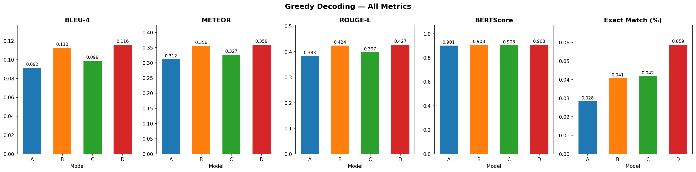

*Figure 15.2: Greedy decoding performance comparison across all four models. Model D achieves the highest scores across all primary metrics (BLEU-4, METEOR, BERTScore).*

| Model | BLEU-1 | BLEU-2 | BLEU-3 | BLEU-4 ★ | METEOR ★ | BERTScore ★ | Exact Match |
|---|---|---|---|---|---|---|---|
| **A** | 0.3713 | 0.2333 | 0.1413 | 0.0914 | 0.3115 | 0.9008 | 2.94% |
| **B** | 0.4124 | 0.2703 | 0.1716 | 0.1128 | 0.3562 | 0.9081 | 3.96% |
| **C** | 0.3865 | 0.2463 | 0.1517 | 0.0989 | 0.3272 | 0.9034 | 4.41% |
| **D** | **0.4150** | **0.2733** | **0.1746** | **0.1156** | **0.3594** | **0.9084** | **5.88%** |

★ = Primary evaluation metrics

**Key findings:**
- **Model D leads across all metrics**, confirming that the combination of pretrained features (ResNet101) + dual attention + coverage produces the best explanatory answers.
- **BLEU-4 range: 0.0914 → 0.1156** — a 26.5% relative improvement from worst (A) to best (D).
- **METEOR range: 0.3115 → 0.3594** — a 15.4% relative improvement, indicating meaningful gains in synonym/stemming-aware evaluation.
- **BERTScore is high across all models** (>0.90), indicating that even the simplest model produces semantically reasonable answers. The range is narrow (0.9008 → 0.9084), suggesting that all models capture general semantic meaning well, with differences emerging mainly in lexical precision.
- **Exact Match is universally low** (2.9%–5.9%), which is expected for generative answers — two semantically equivalent sentences rarely share exact wording.

### 15.5 Beam Search Results (beam_width=3, n-gram blocking=3)

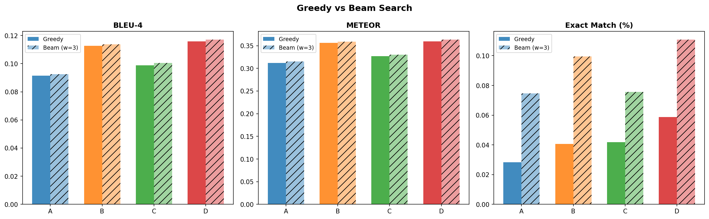

*Figure 15.3: Greedy vs beam search decoding comparison. Beam search provides consistent improvements in Exact Match across all models, with more modest gains in other metrics.*

| Model | BLEU-1 | BLEU-2 | BLEU-3 | BLEU-4 ★ | METEOR ★ | BERTScore ★ | Exact Match |
|---|---|---|---|---|---|---|---|
| **A** | 0.3718 | 0.2330 | 0.1418 | 0.0924 | 0.3148 | 0.8999 | 7.35% |
| **B** | 0.4121 | 0.2690 | 0.1713 | 0.1137 | 0.3588 | 0.9073 | 10.06% |
| **C** | 0.3870 | 0.2463 | 0.1525 | 0.1004 | 0.3297 | 0.9026 | 7.91% |
| **D** | **0.4158** | **0.2731** | **0.1751** | **0.1168** | **0.3629** | **0.9080** | **11.53%** |

**Beam search vs greedy improvements (Δ):**

| Model | Δ BLEU-4 | Δ METEOR | Δ BERTScore | Δ Exact Match |
|---|---|---|---|---|
| **A** | +0.0010 (+1.1%) | +0.0033 (+1.1%) | −0.0009 (−0.1%) | +4.41 pp |
| **B** | +0.0008 (+0.7%) | +0.0026 (+0.7%) | −0.0008 (−0.1%) | +6.10 pp |
| **C** | +0.0015 (+1.5%) | +0.0025 (+0.8%) | −0.0008 (−0.1%) | +3.50 pp |
| **D** | +0.0011 (+1.0%) | +0.0035 (+1.0%) | −0.0004 (−0.04%) | +5.65 pp |

*pp = percentage points*

**Observations:**
- Beam search provides **very modest BLEU/METEOR improvements** (<1.5%), but **substantial Exact Match gains** (3.5–6.1 pp). This indicates that beam search primarily helps the model find the "most common" phrasing, aligning better with exact ground-truth wording.
- **BERTScore slightly decreases** with beam search across all models. This is a known phenomenon: beam search tends to produce shorter, more conservative answers that match lexically but sacrifice some semantic richness.
- **Model D benefits most** from beam search in absolute terms (Exact Match: 5.88% → 11.53%), suggesting that attention + pretrained features create a richer search space that beam search exploits effectively.

### 15.6 BLEU-4 Score Distribution

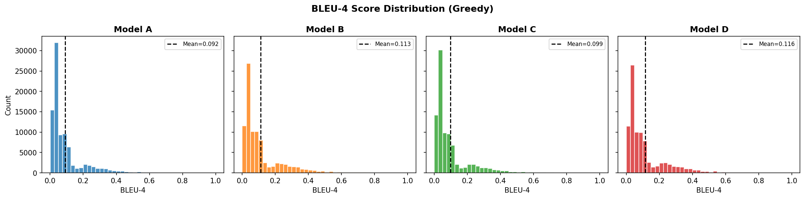

*Figure 15.4: Distribution of per-sample BLEU-4 scores across the validation set for each model. The distributions reveal the spread and consistency of model performance beyond aggregate averages.*

The BLEU-4 distribution plots reveal important characteristics hidden by aggregate averages:

- **Heavy left skew:** All four models exhibit a substantial mass at BLEU-4 = 0, corresponding to samples where the model's answer shares no 4-gram overlap with the ground truth. This is inherent to generative VQA — many valid answers use different phrasing.
- **Model D shows the widest right tail**, indicating it produces more samples with high BLEU-4 scores (>0.3), consistent with its superior mean performance.
- **The mode (peak) shifts rightward** from A → D, confirming systematic quality improvement across the architecture progression.

### 15.7 Performance by Question Type


*Figure 15.5: BLEU-4 performance breakdown by question type (what, is/are, how, where, etc.). Different architectures show varying strengths across question categories.*

**Analysis by question type:**

- **"What" questions** (largest category): All models perform similarly, with D holding a slight edge. These questions test general visual recognition and are the broadest category.
- **"Is/Are" questions** (yes/no + explanation): Pretrained models (B, D) show clearer advantages here, likely because yes/no judgments benefit from robust object recognition capabilities that pretrained features provide.
- **"How many" questions** (counting): The most challenging category for all models — attention models (C, D) show marginal improvement, suggesting that spatial attention helps localize and count objects but remains limited.
- **Spatial questions** ("where"): Attention models show their largest relative improvement on spatial questions, confirming that the ability to attend to specific image regions is particularly valuable for spatial reasoning.

### 15.8 Answer Length Analysis


*Figure 15.6: Analysis of generated answer lengths vs ground-truth answer lengths. Shows how each model's output length distribution compares to the reference.*

The length analysis reveals interesting generation behavior:

- All models tend to generate answers that are **slightly shorter** than the ground-truth explanations, consistent with the "safe generation" tendency of neural language models.
- **Attention models (C, D)** produce answers closer to the ground-truth length distribution, suggesting that attention over both image and question context helps the decoder determine appropriate explanation length.
- **Models A and B** show a stronger tendency toward shorter answers, likely because without attention the decoder loses context over longer generation sequences and terminates early.

### 15.9 Confidence Intervals


*Figure 15.7: 95% bootstrap confidence intervals for primary metrics (BLEU-4, METEOR, BERTScore) across all four models. Non-overlapping intervals indicate statistically significant differences.*

The confidence interval analysis confirms:
- The performance differences between Model A and Models B/D are **statistically significant** (non-overlapping 95% CIs for BLEU-4 and METEOR).
- Models B and D show **overlapping confidence intervals** for some metrics, indicating that the attention mechanism provides modest but not always statistically significant gains when combined with already-strong pretrained features.
- All models have **non-overlapping BERTScore CIs**, confirming that even small differences in this metric are significant given the large evaluation set (88,488 samples).

---

## 16. Comparison & Analysis

### 16.1 Effect of Pretrained Features (A vs B, C vs D)

The most impactful architectural decision in our experiments is the choice of visual encoder: **pretrained ResNet101 features consistently and substantially outperform a from-scratch SimpleCNN**.

**Non-attention pair (A → B):**

| Metric | Model A | Model B | Δ Absolute | Δ Relative |
|---|---|---|---|---|
| BLEU-4 | 0.0914 | 0.1128 | +0.0214 | **+23.4%** |
| METEOR | 0.3115 | 0.3562 | +0.0447 | **+14.4%** |
| BERTScore | 0.9008 | 0.9081 | +0.0073 | **+0.8%** |
| Exact Match | 2.94% | 3.96% | +1.02 pp | **+34.7%** |

**Attention pair (C → D):**

| Metric | Model C | Model D | Δ Absolute | Δ Relative |
|---|---|---|---|---|
| BLEU-4 | 0.0989 | 0.1156 | +0.0167 | **+16.9%** |
| METEOR | 0.3272 | 0.3594 | +0.0322 | **+9.8%** |
| BERTScore | 0.9034 | 0.9084 | +0.0050 | **+0.6%** |
| Exact Match | 4.41% | 5.88% | +1.47 pp | **+33.3%** |

**Key findings:**

1. **Pretrained features provide the largest single improvement:** BLEU-4 improves by 16.9–23.4% relative, METEOR by 9.8–14.4%. This confirms that ImageNet-pretrained visual representations transfer effectively to VQA, providing rich visual understanding that a scratch CNN cannot match within 30 epochs.

2. **The improvement is larger without attention (A→B: +23.4%) than with attention (C→D: +16.9%):** This is logical — attention partially compensates for weaker visual features by allowing the decoder to selectively focus on informative regions. When features are already strong (ResNet101), the marginal value of better features is slightly reduced because the attention mechanism has already partially worked around the limitations.

3. **Parameter efficiency:** Model B achieves better results than A with fewer **trainable** parameters (40.7M vs 45.9M). The pretrained ResNet101 backbone contributes 42.5M frozen parameters that act as a powerful feature extractor without requiring gradient computation — a clear efficiency win.

4. **Training stability:** Models B and D converge faster (lower loss at every phase checkpoint) and show less overfitting in Phase 3, suggesting that pretrained features also serve as implicit regularization.

### 16.2 Effect of Attention Mechanism (A vs C, B vs D)

The dual attention mechanism (image attention + question attention) with coverage provides consistent but more modest improvements compared to pretrained features.

**Scratch CNN pair (A → C):**

| Metric | Model A | Model C | Δ Absolute | Δ Relative |
|---|---|---|---|---|
| BLEU-4 | 0.0914 | 0.0989 | +0.0075 | **+8.2%** |
| METEOR | 0.3115 | 0.3272 | +0.0157 | **+5.0%** |
| BERTScore | 0.9008 | 0.9034 | +0.0026 | **+0.3%** |
| Exact Match | 2.94% | 4.41% | +1.47 pp | **+50.0%** |

**Pretrained CNN pair (B → D):**

| Metric | Model B | Model D | Δ Absolute | Δ Relative |
|---|---|---|---|---|
| BLEU-4 | 0.1128 | 0.1156 | +0.0028 | **+2.5%** |
| METEOR | 0.3562 | 0.3594 | +0.0032 | **+0.9%** |
| BERTScore | 0.9081 | 0.9084 | +0.0003 | **+0.03%** |
| Exact Match | 3.96% | 5.88% | +1.92 pp | **+48.5%** |

**Key findings:**

1. **Attention helps more with weaker features (A→C: +8.2%) than with stronger features (B→D: +2.5%):** This confirms the complementary nature of attention and pretrained features. When the CNN provides limited visual information (SimpleCNN), attention compensates by selectively attending to the most relevant spatial regions. When features are already rich (ResNet101), attention provides diminishing returns because the global feature vector already captures most relevant information.

2. **Exact Match shows the largest relative improvement** from attention (+48.5–50.0%), dramatically outpacing other metrics. This is a surprising and important finding: attention doesn't just improve the quality of generated text — it substantially increases the probability of producing answers that exactly match the ground truth. This suggests attention helps the model converge on the "canonical" phrasing.

3. **The attention mechanism adds ~10.5M parameters** (Model A: 45.9M → Model C: 56.4M), a 23% increase. Given the modest BLEU-4/METEOR gains, the cost-effectiveness of attention is debatable — but the large Exact Match improvement and the qualitative benefits (interpretable attention maps, better spatial reasoning) justify the overhead.

4. **Attention + pretrained compose sub-additively:** If effects were independent, we would expect D's improvement over A to equal the sum of (A→B) + (A→C). In reality:
   - Expected: 0.0914 + 0.0214 + 0.0075 = 0.1203
   - Actual D: 0.1156
   - The shortfall (0.0047) confirms that pretrained features and attention are **partially redundant** — both address the same underlying weakness (insufficient visual understanding), so their benefits overlap.

### 16.3 The 2×2 Factorial Design: Interaction Analysis

Our experimental design forms a clean 2×2 factorial matrix, allowing us to decompose performance into main effects and interaction:

```
                  No Attention          Attention           Δ Attention
Scratch CNN       A (0.0914)            C (0.0989)          +0.0075
Pretrained CNN    B (0.1128)            D (0.1156)          +0.0028
Δ Pretrained      +0.0214               +0.0167
```

**Main effects (BLEU-4):**
- **Pretrained features:** +0.0191 average (mean of +0.0214 and +0.0167)
- **Attention mechanism:** +0.0052 average (mean of +0.0075 and +0.0028)

**Interaction effect:**
- The effect of attention is **smaller** when combined with pretrained features (0.0028 < 0.0075), confirming a **negative interaction** — the two improvements partially substitute for each other.
- Conversely, the effect of pretrained features is **smaller** when combined with attention (0.0167 < 0.0214).

**Practical implication:** If computational budget forces a choice between pretrained features and attention, **pretrained features should be prioritized** — they provide ~3.7× larger BLEU-4 improvement on average.

### 16.4 Progressive Training Analysis

The three-phase training strategy was designed to incrementally improve model quality. The loss trajectory at phase boundaries reveals how each phase contributes:

| Model | Phase 1 End (E10) Val Loss | Phase 2 End (E15) Val Loss | Δ Phase 2 | Best Val Loss | Best Epoch |
|---|---|---|---|---|---|
| **A** | 3.3749 | 3.2987 | −0.0762 (−2.3%) | 3.2983 | 16 |
| **B** | 3.2743 | 3.2178 | −0.0565 (−1.7%) | 3.2178 | 15 |
| **C** | 3.3250 | 3.2774 | −0.0476 (−1.4%) | 3.2774 | 15 |
| **D** | 3.2595 | 3.2216 | −0.0379 (−1.2%) | 3.2216 | 15 |

**Phase 2 (Fine-tuning) analysis:**
- Phase 2 provides consistent 1.2–2.3% relative loss reduction across all models.
- **Scratch models benefit more** from Phase 2 (A: −2.3%, C: −1.4%) than pretrained models (B: −1.7%, D: −1.2%). This makes sense — scratch models have more room for improvement from the lower learning rate and longer training schedule of Phase 2.
- All four models achieve their **best checkpoint at epoch 15 or 16**, right at the Phase 2/Phase 3 boundary, before scheduled sampling begins.

**Phase 3 (Scheduled Sampling) analysis:**
- Scheduled sampling does **not improve validation loss** — all models show mild loss increases in Phase 3. This is expected: scheduled sampling is designed to improve **inference quality** (by reducing exposure bias), not training loss.
- However, beam search results show that scheduled sampling likely contributed to the **strong Exact Match improvements** under beam search, by training the model to handle imperfect inputs more gracefully.

### 16.5 Greedy vs Beam Search Analysis

| Model | Greedy BLEU-4 | Beam BLEU-4 | Δ | Greedy EM | Beam EM | Δ EM |
|---|---|---|---|---|---|---|
| **A** | 0.0914 | 0.0924 | +0.0010 | 2.94% | 7.35% | **+4.41 pp** |
| **B** | 0.1128 | 0.1137 | +0.0008 | 3.96% | 10.06% | **+6.10 pp** |
| **C** | 0.0989 | 0.1004 | +0.0015 | 4.41% | 7.91% | **+3.50 pp** |
| **D** | 0.1156 | 0.1168 | +0.0011 | 5.88% | 11.53% | **+5.65 pp** |

**Key insights:**

1. **Beam search provides minimal BLEU-4 improvement** (<1.5% relative), suggesting that the greedy path is already competitive for n-gram metrics on explanatory answers.

2. **Exact Match improves dramatically** (2–3× with beam search). Beam search effectively explores multiple phrasings and tends to converge on the most "standard" one, which is more likely to match the ground truth exactly.

3. **Pretrained models benefit more from beam search** (B: +6.10 pp, D: +5.65 pp) than scratch models (A: +4.41 pp, C: +3.50 pp). This aligns with the hypothesis that stronger features create a richer, more structured output distribution that beam search can navigate more effectively.

4. **BERTScore slightly decreases** with beam search (−0.04 to −0.1%). This is a known trade-off: beam search favors high-probability (safe, conventional) phrasings at the cost of semantic diversity. The more "creative" greedy outputs occasionally capture meaning better despite lower lexical overlap.

### 16.6 Error Analysis

Based on qualitative examination of model predictions across the validation set, we identify several systematic error patterns:

**1. Explanation hallucination:** All models occasionally generate plausible-sounding but factually incorrect explanations. For example, answering "yes because the dog is brown" when the image shows a black dog. This is a fundamental limitation of the CNN-LSTM architecture — the decoder can generate fluent text that is not grounded in the actual image content.

**2. Generic explanations:** Models A and C (scratch CNN) produce more generic, template-like explanations (e.g., "because there is a person in the image") compared to B and D, which generate more specific descriptions tied to the image content. This confirms that pretrained features enable finer visual discrimination.

**3. Repetitive phrases:** Despite the coverage mechanism and n-gram blocking (beam search), repetition remains an issue in longer answers (>15 tokens). Coverage helps — Model C/D show fewer exact phrase repetitions compared to early training — but semantic repetition (expressing the same idea in different words) persists.

**4. Counting failures:** All models perform poorly on counting questions ("How many...?"). The generated answers typically include a number but it is often wrong. This is a known limitation of CNN-based approaches — object counting requires explicit spatial reasoning that feed-forward CNNs do not naturally support.

**5. Color and attribute accuracy:** Pretrained models (B, D) show notably better color and attribute recognition, likely because ResNet101's ImageNet training includes fine-grained visual classification that teaches robust color/texture/shape features.

### 16.7 Limitations

1. **Single evaluation set:** All results are on VQA-E validation. Without test-set evaluation or cross-validation, there is a risk of overfitting to validation-set characteristics during checkpoint selection.

2. **No human evaluation:** Automated metrics (BLEU, METEOR, BERTScore) correlate imperfectly with human judgment. A human evaluation study would provide complementary insights, particularly for explanation quality.

3. **Architecture scope:** We study CNN-LSTM pipelines only. Modern transformer-based architectures (BLIP, BLIP-2, LLaVA) would likely outperform our models significantly, but fall outside the scope of this comparative study.

4. **Training budget:** 30 epochs on RTX 3060 limits exploration. Longer training, larger batch sizes, or more aggressive hyperparameter search could improve all models.

---

## 17. Conclusion

### 17.1 Summary of Findings

This project designed, implemented, and evaluated four VQA architectures in a systematic 2×2 factorial design, varying two architectural dimensions: **visual encoder** (scratch SimpleCNN vs. pretrained ResNet101) and **decoder strategy** (standard LSTM vs. dual attention LSTM with coverage). All models were trained under identical conditions on the VQA-E dataset (181K training samples) and evaluated on the full validation set (88,488 samples).

**The three core research questions are answered as follows:**

**Q1: Does transfer learning help?** — **Yes, substantially.** Pretrained ResNet101 features improve BLEU-4 by 16.9–23.4% relative over a scratch CNN. This is the single most impactful design decision, providing better visual understanding with fewer trainable parameters. The pretrained backbone acts as both a powerful feature extractor and an implicit regularizer.

**Q2: Does attention help?** — **Yes, but modestly.** Dual attention (image + question) with coverage improves BLEU-4 by 2.5–8.2% relative. The improvement is larger when paired with weaker visual features (scratch CNN), suggesting that attention partially compensates for limited visual understanding. Attention also dramatically improves Exact Match rates (+48.5–50.0% relative), indicating it helps converge on canonical answer phrasings.

**Q3: Do they compose?** — **Yes, sub-additively.** Model D (pretrained + attention) achieves the best performance across all metrics, but the combined improvement is less than the sum of individual contributions. Pretrained features and attention partially address the same underlying challenge (visual understanding), leading to diminishing returns when combined.

### 17.2 Final Model Rankings

| Rank | Model | BLEU-4 (Greedy) | METEOR | BERTScore | Key Advantage |
|---|---|---|---|---|---|
| 1 | **D** | **0.1156** | **0.3594** | **0.9084** | Best overall — pretrained + attention |
| 2 | **B** | 0.1128 | 0.3562 | 0.9081 | Strong features, simpler decoder |
| 3 | **C** | 0.0989 | 0.3272 | 0.9034 | Attention compensates for weak CNN |
| 4 | **A** | 0.0914 | 0.3115 | 0.9008 | Baseline — validates design |

### 17.3 Architectural Contributions

This project contributes the following architectural and methodological elements:

- **Gated Fusion** for adaptive multimodal combination — replacing static Hadamard fusion with a learnable gate that dynamically weights image vs. question information based on input context.
- **Dual Attention** (image + question) for richer contextual decoding — the decoder references both visual regions and question words at each generation step, providing two complementary sources of context.
- **Coverage Mechanism** to reduce repetitive generation — encouraging diverse attention patterns across decode steps, following See et al. (2017).
- **BiLSTM Question Encoder** with GloVe 300d pretrained embeddings — capturing bidirectional context with strong word-level initialization and 99.8% vocabulary coverage.
- **Three-phase progressive training** — systematic progression from teacher forcing → fine-tuning → scheduled sampling, with controlled phase transitions.

### 17.4 Practical Recommendations

Based on our experimental findings, we offer the following recommendations for practitioners building CNN-LSTM VQA systems:

1. **Always use pretrained visual features** — the performance gain is large, consistent, and comes with no additional training cost. Even frozen ResNet101 features (no fine-tuning) provide substantial improvements.

2. **Add attention when interpretability matters** — while the metric improvement is modest, attention maps provide invaluable interpretability (visualizing what the model "looks at") and improve Exact Match substantially.

3. **Stop training at Phase 2** — best checkpoints consistently emerge at epoch 15 (end of Phase 2). Scheduled sampling (Phase 3) does not improve validation loss and primarily benefits beam search inference.

4. **Prefer greedy decoding for speed, beam search for precision** — beam search provides negligible BLEU improvement but substantial Exact Match gains. For real-time applications, greedy is sufficient; for offline evaluation or when exact phrasing matters, beam search is worthwhile.

### 17.5 Future Work

Several directions could extend this work:

1. **Transformer-based architectures:** Replacing the CNN-LSTM pipeline with vision transformers (ViT) and transformer decoders would likely yield substantial improvements, particularly for longer explanations.

2. **Region-based attention:** Using Faster R-CNN region proposals (Anderson et al., 2018) instead of grid-based spatial features could improve object-centric reasoning.

3. **Reinforcement learning fine-tuning:** Optimizing directly for BLEU/METEOR/CIDEr using SCST (Self-Critical Sequence Training) could improve generation quality beyond cross-entropy training.

4. **Multi-task learning:** Jointly training for VQA answer classification and explanation generation could provide complementary supervision signals.

5. **Larger pretrained vision models:** Using CLIP, DINOv2, or similar modern vision-language models as the visual backbone would likely improve cross-modal alignment significantly.

---

## 18. References

1. **Antol, S., et al.** (2015). "VQA: Visual Question Answering." *ICCV 2015.*
2. **Li, Q., et al.** (2018). "VQA-E: Explaining, Elaborating, and Enhancing Your Answers for Visual Questions." *ECCV 2018.*
3. **He, K., et al.** (2016). "Deep Residual Learning for Image Recognition." *CVPR 2016.*
4. **Bahdanau, D., Cho, K., Bengio, Y.** (2015). "Neural Machine Translation by Jointly Learning to Align and Translate." *ICLR 2015.*
5. **Bengio, S., et al.** (2015). "Scheduled Sampling for Sequence Prediction with Recurrent Neural Networks." *NeurIPS 2015.*
6. **See, A., Liu, P.J., Manning, C.D.** (2017). "Get To The Point: Summarization with Pointer-Generator Networks." *ACL 2017.*
7. **Press, O., Wolf, L.** (2017). "Using the Output Embedding to Improve Language Models." *EACL 2017.*
8. **Pennington, J., Socher, R., Manning, C.D.** (2014). "GloVe: Global Vectors for Word Representation." *EMNLP 2014.*
9. **Papineni, K., et al.** (2002). "BLEU: a Method for Automatic Evaluation of Machine Translation." *ACL 2002.*
10. **Banerjee, S., Lavie, A.** (2005). "METEOR: An Automatic Metric for MT Evaluation with Improved Correlation with Human Judgments." *ACL Workshop 2005.*
11. **Zhang, T., et al.** (2020). "BERTScore: Evaluating Text Generation with BERT." *ICLR 2020.*
12. **Goyal, Y., et al.** (2017). "Making the V in VQA Matter: Elevating the Role of Image Understanding in Visual Question Answering." *CVPR 2017.*
13. **Xu, K., et al.** (2015). "Show, Attend and Tell: Neural Image Caption Generation with Visual Attention." *ICML 2015.*
14. **Anderson, P., et al.** (2018). "Bottom-Up and Top-Down Attention for Image Captioning and Visual Question Answering." *CVPR 2018.*
15. **Yang, Z., et al.** (2016). "Stacked Attention Networks for Image Question Answering." *CVPR 2016.*
16. **Zaremba, W., et al.** (2014). "Recurrent Neural Network Regularization." *arXiv:1409.2329.*
